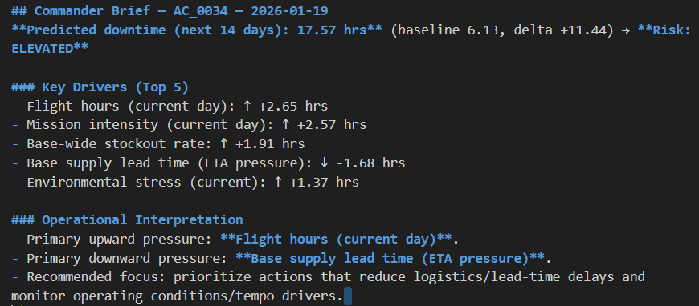
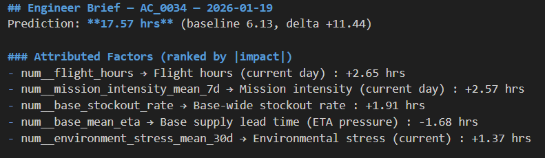
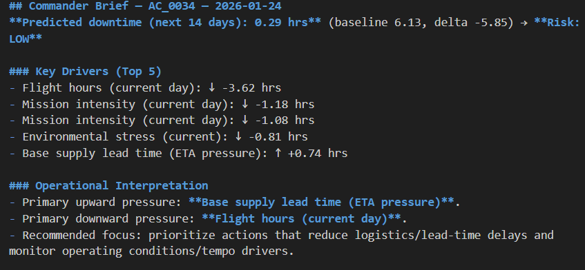

# ASDS – AI Sustainment Decision Support System

ASDS is an AI-enabled decision-support platform designed to predict aircraft downtime risk and translate model outputs into mission-ready insights for maintenance planning and operational readiness.

The system combines machine learning (LightGBM) with SHAP-based explainability to not only forecast risk, but clearly identify the operational factors driving those predictions.

Beyond prediction, ASDS transforms raw sustainment data into actionable outputs through risk prioritization, readiness-focused summaries, and mission brief-style reporting—demonstrating how AI systems support human-in-the-loop decision-making in mission-critical environments.

ASDS demonstrates how aerospace and defense organizations operationalize AI by converting telemetry and predictive analytics into decision advantage for operators, maintainers, and leadership.

---

## Key Capabilities

- Predicts near-term aircraft downtime risk using LightGBM-based machine learning models  
- Provides transparent model outputs using SHAP explainability to identify key operational risk drivers  
- Transforms raw sustainment and logistics data into structured, model-ready feature pipelines  
- Generates mission-ready outputs including executive summaries, readiness assessments, and mission brief-style reports  
- Implements risk categorization and prioritization logic to identify high-risk assets requiring maintenance action  
- Supports human-in-the-loop decision-making by translating analytics into actionable operational insights  
- Demonstrates end-to-end data-to-decision pipeline from telemetry ingestion to readiness-focused outputs  

---

## Operational Impact

ASDS demonstrates how AI can be applied to real-world sustainment challenges by:

- Converting predictive analytics into actionable maintenance decisions
- Providing transparency into model outputs for operator trust
- Supporting readiness-focused decision-making under uncertainty
- Modeling how AI systems integrate into mission-critical environments

---

## Why This Matters

Modern aerospace and defense operations depend on accurate, timely, and explainable decision-making to maintain mission readiness.

ASDS demonstrates how AI-driven analytics can:

- Anticipate system failures before they impact operations  
- Prioritize maintenance actions based on risk and mission impact  
- Improve sustainment efficiency in resource-constrained environments  
- Provide transparent, explainable outputs to support human decision-makers  

This reflects real-world defense challenges where system availability directly influences mission success and operational effectiveness.

---

## System Architecture

ASDS implements an end-to-end data-to-decision pipeline:

1. **Data Ingestion**  
   Simulated aircraft operational and maintenance telemetry  

2. **Feature Engineering Pipeline**  
   Aggregates usage patterns, failure indicators, and system stress metrics into structured inputs  

3. **Predictive Modeling Layer**  
   LightGBM model forecasts likelihood of near-term downtime  

4. **Explainability Layer**  
   SHAP analysis identifies key drivers influencing each prediction  

5. **Decision Support Outputs**  
   Generates readiness summaries, risk prioritization, and mission brief-style reports  

---

## Platform Screenshots

### AI-Generated Mission Brief (Elevated Risk)

This output demonstrates how ASDS translates model predictions and SHAP-based explainability into mission-relevant insights, highlighting elevated risk conditions and key operational drivers.

---

### Explainable AI (SHAP Attribution)

ASDS incorporates explainable AI to identify the primary factors driving predicted downtime, enabling transparent and defensible decision-making.

---

### AI-Generated Mission Brief (Low Risk Scenario)

The system captures variability across operating conditions, providing context-aware outputs that reflect both elevated and reduced risk scenarios across the fleet.